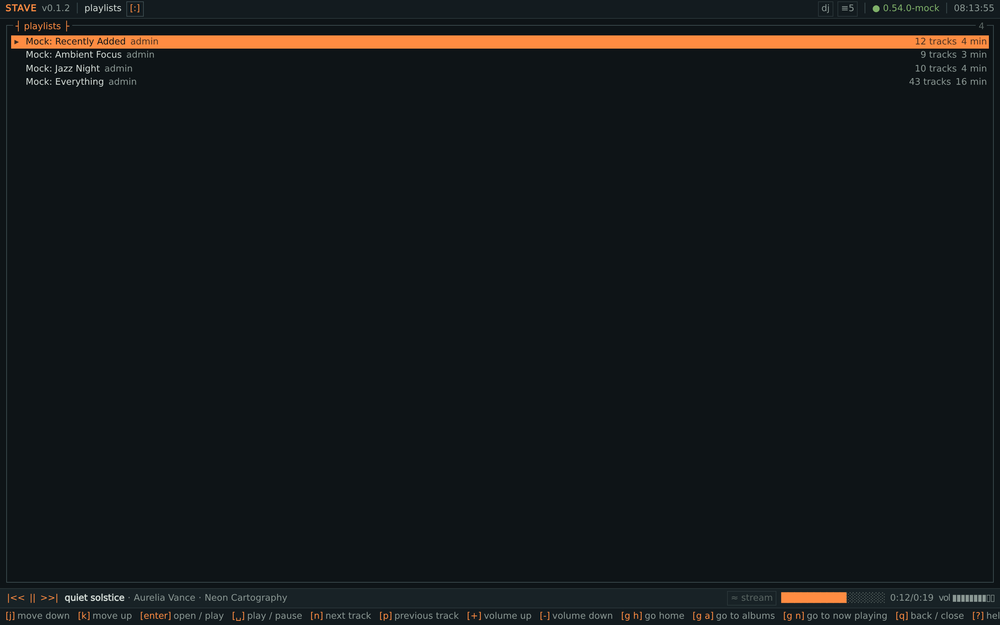
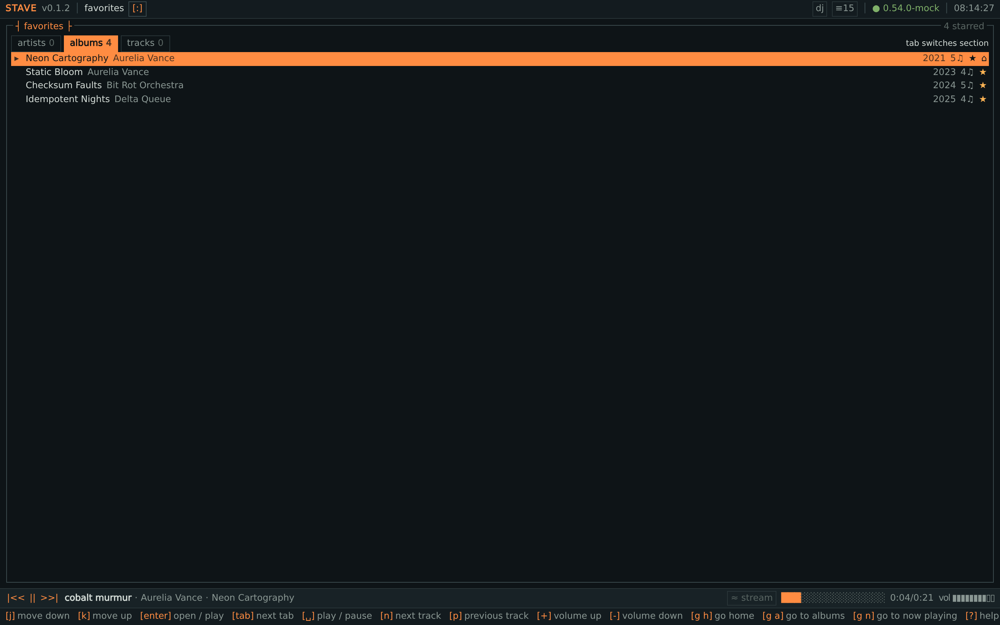
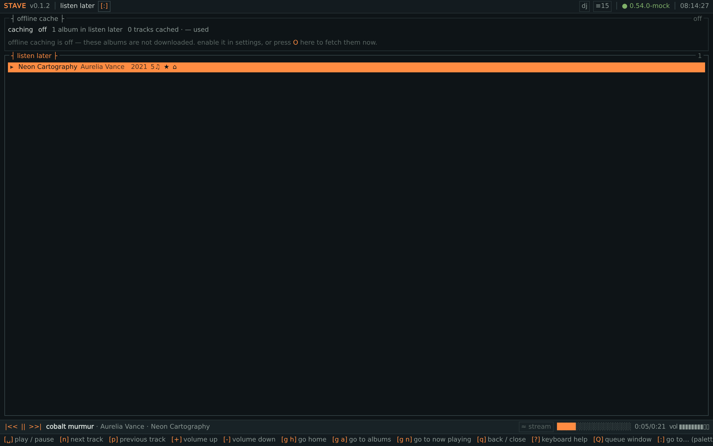
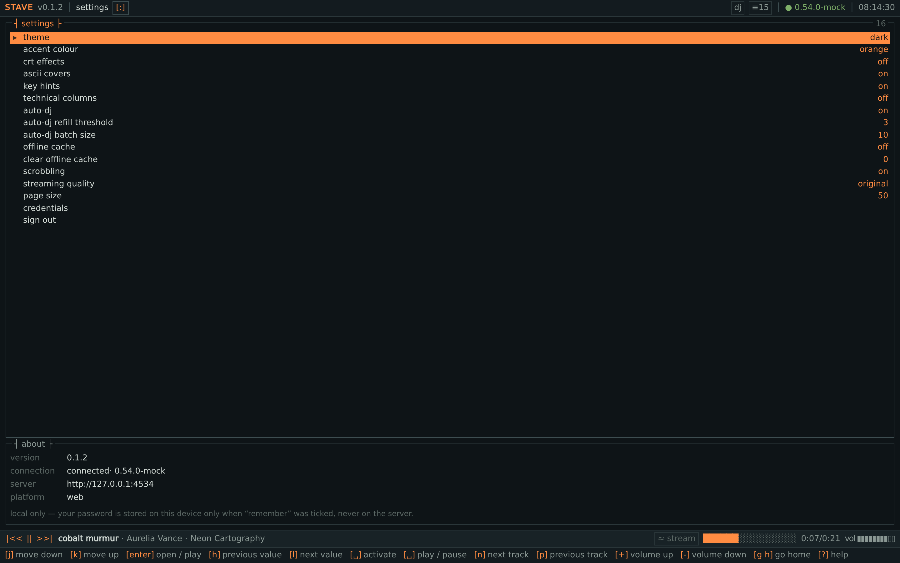
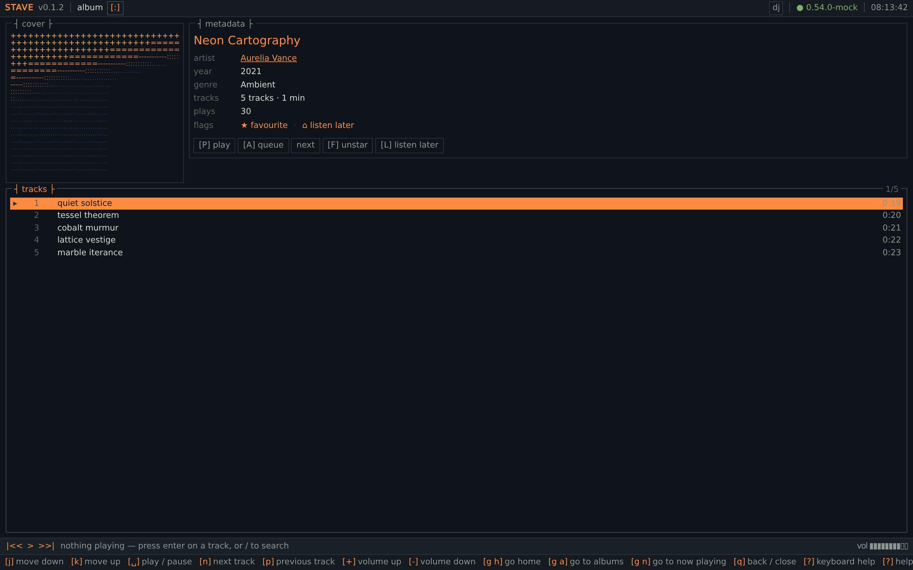
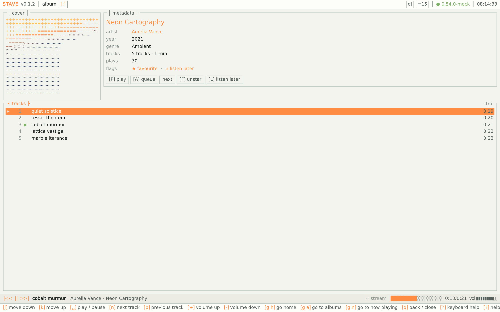
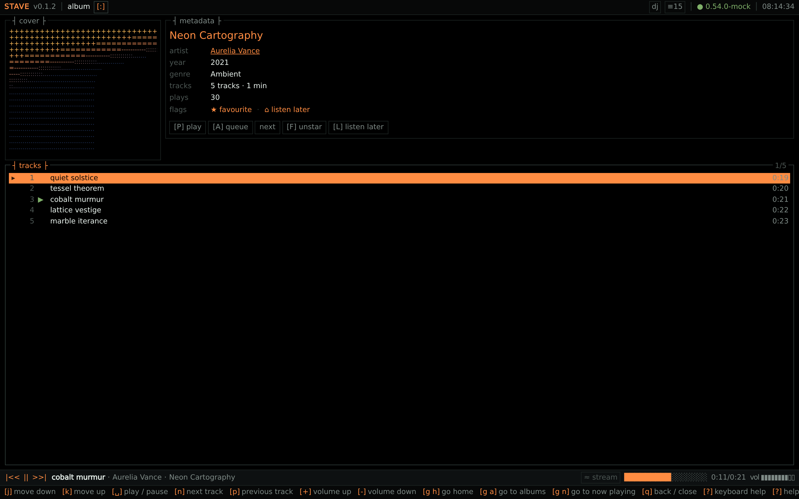
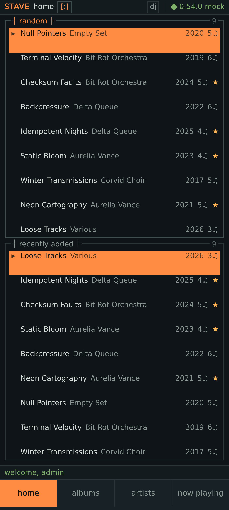
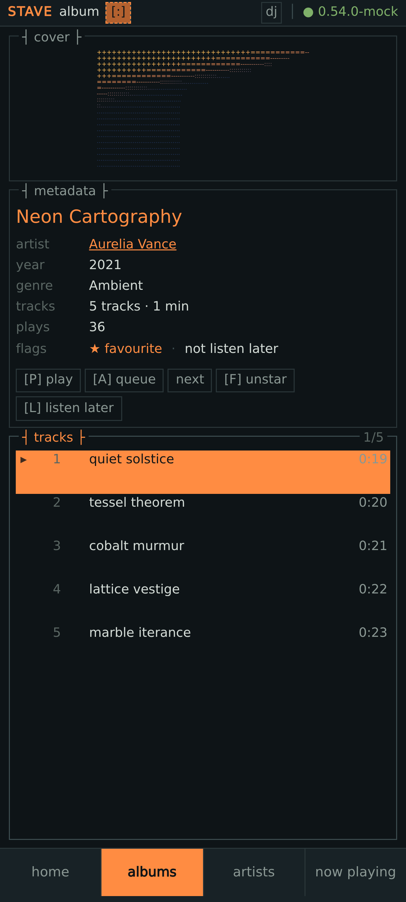
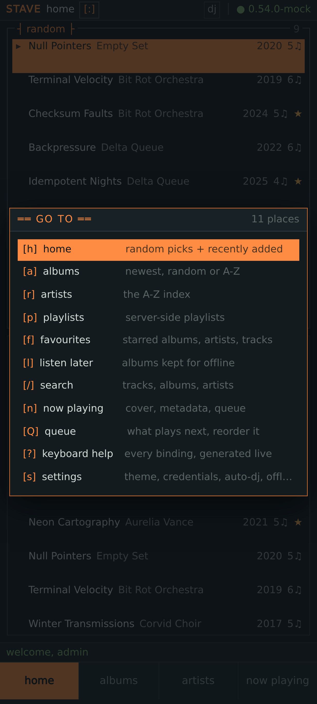

# stave

A **terminal-inspired music client** for Subsonic/Navidrome servers: a PWA you
can host on NixOS, and an Android app built from the same source.

It looks like a piece of terminal software — monospace grid, box-drawn panes,
block-character meters, ASCII cover art — and on the desktop it is driven
entirely by the keyboard, vim-style.

> Name: the project directory is provisionally `stave`.

```
┌─ albums ──────────────────────────────── album A-Z · 24 ┐
▸ Neon Cartography              Aurelia Vance    2021  5♫  ★
  Static Bloom                  Aurelia Vance    2023  4♫  ⌂
  Terminal Velocity             Bit Rot Orchestra 2019 6♫
  ...
└─────────────────────────────────────────────────────────┘
```


---

## Features

**Browsing**

- Home page: random albums + recently added albums, side by side.
- Album list: random, recently added, recently played, most played, album A-Z,
  artist A-Z.
- Artist index (A-Z, jump by letter) and artist pages with albums, top tracks,
  biography and similar artists.
- Album pages with cover art, metadata and the track list.
- Playlists, favourites (server-side stars) and **listen later** (local only).

**Playback**

- Queue management: reorder (`J`/`K`), remove (`x`), clear, jump, shuffle,
  repeat off/all/one.
- Every album/track can be played now, **played next** or **added to the end of
  the queue** — from the list, the album page, the artist page, search, or the
  action menu.
- **Auto-DJ**: when the queue runs dry it appends tracks similar to what was
  just played (server similarity first, local heuristics as a fallback), so it
  behaves like an endless radio.
- Scrobbling via the Subsonic `scrobble` API, with "now playing" reporting.

**Offline**

- Optional offline cache, **off by default**, enabled in settings. It downloads
  the albums on your listen-later list; playback then prefers the local copy and
  the UI shows where each track is coming from (`▣ local` / `≈ stream`).
- On Android the audio goes to the app's data directory (survives WebView cache
  purges); on the web it goes to IndexedDB.
- Listen later is never sent to the server — it is a private local list.

**Interface**

- Themes: dark, light, AMOLED. Accent colours (including a monochrome one).
- Optional CRT scanline overlay, ASCII cover art, dense technical columns.
- MediaSession integration: lock screen / notification / head-unit controls.

**Keyboard-first** — everything is reachable without a mouse. See
[docs/KEYBINDINGS.md](docs/KEYBINDINGS.md). The help overlay (`?`) is generated
from the same binding registry the app executes, so it cannot go stale.

---

## Screenshots

Every picture below is the production build talking to the demo library the
quick start sets up. `just screenshots` regenerates them from the running app,
so they follow the UI instead of drifting away from it.

**Browsing**


**Playback**


**Search, playlists and favourites**








**Interface**




---

## Quick start

Everything is provided by the Nix flake — Node, pnpm, JDK 21, the Android SDK,
ffmpeg (to generate a demo library), Navidrome and the mock server.

```sh
git clone <this repo> && cd stave
nix develop            # or: direnv allow

just seed-library      # generate a royalty-free demo library (ffmpeg, no downloads)
just navidrome         # run a throwaway Navidrome on it: http://127.0.0.1:4533  (admin/admin)
just dev               # vite dev server: http://localhost:5173
```

Then point the app at your server in the login form. `just mock` runs the mock
Subsonic server instead (`:4534`, `admin/admin`), which is what the e2e suite
uses.


Without Nix, any Node 22+ and pnpm will do for the web build
(`pnpm install && pnpm dev`); `just` is optional but assumed below.

```sh
just test          # unit + component tests (vitest)
just coverage      # coverage report
just e2e           # Playwright, driving the real build with the keyboard
just verify        # format + lint + types + tests + build
```

---

## Hosting it on NixOS

The flake exposes two NixOS modules: the web app, and an optional Navidrome
backend.

```nix
{
  inputs.stave.url = "github:dbeley/stave";

  # ...
  imports = [ inputs.stave.nixosModules.default ];

  services.stave = {
    enable = true;
    hostName = "music.example.org";
    # Public prefill only — never a password. Credentials are entered in the
    # browser and stored on the device.
    server = "https://navidrome.example.org";
    openFirewall = true;
  };
}
```

With the optional backend module, one import gives you a working stack —
Navidrome plus the app, already wired to it:

```nix
imports = [ inputs.stave.nixosModules.navidrome ];

services.stave.navidrome = {
  enable = true;
  musicFolder = "/srv/music";
  # Last.fm / transcoding secrets, if you have them:
  environmentFile = "/run/secrets/navidrome-env";
};
```

`services.stave.navidrome.serveApp` (default `true`) also enables and
pre-fills the web app.

Other flake outputs:

| output                   | what                                                       |
| ------------------------ | ---------------------------------------------------------- |
| `packages.default`       | the built SPA (`nix build`)                                |
| `packages.spa-subpath`   | same, built to be served under `/stave/`                   |
| `packages.seed-library`  | generate the royalty-free demo library                     |
| `packages.dev-navidrome` | throwaway Navidrome on that library                        |
| `packages.mock-subsonic` | mock Subsonic server for tests                             |
| `devShells.default`      | the full toolchain                                         |
| `checks.*`               | unit tests and NixOS module evaluation (`nix flake check`) |
| `overlays.default`       | adds `pkgs.stave`                                          |

A `Dockerfile` is included for hosts that are not NixOS (`docker build -t stave .`).

---

## Theming, including stylix

Themes are picked with `T` (or in the settings page): `dark`, `light`, `amoled`,
and — when your deployment supplies one — `host`.







`host` uses a palette the module writes into the app's runtime config. If you use
[stylix](https://github.com/nix-community/stylix), its colours are picked up
automatically, so the app matches the rest of your desktop:

```nix
services.stave = {
  enable = true;
  hostName = "music.example.org";
  # nothing else to do
};
```

When `stylix.enable` is set, its base16 palette is mapped onto the app's tokens
(background, foreground, borders, accent, and the semantic colours). Stylix is
_not_ a dependency of this flake — the module only reads it if it is already in
your configuration, and stays out of the way otherwise.

You can also supply or override colours directly, with or without stylix:

```nix
services.stave.palette = {
  accent = "#ff8c42";
  bg = "#0e1417";
};
```

Valid keys: `bg`, `bgElev`, `bgElev2`, `fg`, `fgDim`, `fgFaint`, `border`,
`borderFocus`, `accent`, `accentDim`, `ok`, `warn`, `danger`, `info`. Anything
omitted keeps its built-in value, and an unknown key is an evaluation error
rather than a colour that silently does nothing. With stylix enabled these are
applied _on top_ of its palette, so you only set what you want to differ.

These are public values, like the pre-filled server URL: they are served to every
browser in `config.js`. No credentials are ever written there.

With neither stylix nor an explicit palette, the `host` theme is not offered at
all — the app falls back to its own token sets, which is what you want on a phone
or on a machine whose desktop you are not theming.

---

## Android

```sh
just android-sync       # build + cap sync + add the platform on first run
just android-build      # debug APK -> android/app/build/outputs/apk/debug/
just android-release    # release APK (needs the signing env vars below)
```

The same bundle is a responsive app: on a phone the panes stack, the key hints
give way to a bottom tab bar, and the go-to palette (`:`) becomes the
navigation.







Signing is driven by the usual environment variables
(`ANDROID_KEYSTORE_PATH`, `ANDROID_KEYSTORE_PASSWORD`, `ANDROID_KEY_ALIAS`,
`ANDROID_KEY_PASSWORD`). See [docs/ANDROID.md](docs/ANDROID.md) for the NixOS
specifics (the `aapt2` patch), background playback and the release checklist.

---

## Project layout

```
src/lib/api/        Subsonic client: token auth, typed errors, wire->domain mapping
src/lib/domain/     the normalised model the whole UI speaks
src/lib/stores/     runes-based stores (settings, queue, library, favorites, …)
src/lib/player/     playback, auto-DJ, MediaSession
src/lib/offline/    IndexedDB cache, blob stores, download manager, resolver
src/lib/keyboard/   binding registry, vim key sequences, list navigation
src/lib/ui/         shared item actions (the spec's click behaviour, once)
src/lib/components/ the TUI design system (Panel, ListView, Meters, overlays)
src/lib/pages/      one file per route
tools/mock-subsonic/ a dependency-free Subsonic server for tests and e2e
nix/                NixOS modules
docs/               UI reference, key bindings, architecture, Android notes
```

More detail: [docs/ARCHITECTURE.md](docs/ARCHITECTURE.md) and
[docs/UI-REFERENCE.md](docs/UI-REFERENCE.md).

---

## Design decisions worth knowing

- **Credentials stay on the client.** The server may pre-fill the URL and
  username at deploy time, but never a password; the app stores it on the device
  only if you tick "remember".
- **Hash routing, no SvelteKit.** The app is a static bundle, so it can be
  served by nginx, dropped on GitHub Pages, or loaded from a WebView with no
  rewrites.
- **Everything is injected.** The Subsonic client takes a `fetch`, the player
  takes an audio port and a URL resolver, the stores take a client accessor.
  That is what makes playback, the offline cache and the keyboard testable
  without a browser or a server.
- **One binding table.** Behaviour, the hint bar and the help overlay all read
  the same registry, so a shortcut cannot exist undocumented.
- **Listen later is local.** It drives the offline cache and is deliberately
  never synced to the server.

## Licence

GPL-3.0-or-later. See [LICENSE](LICENSE).
